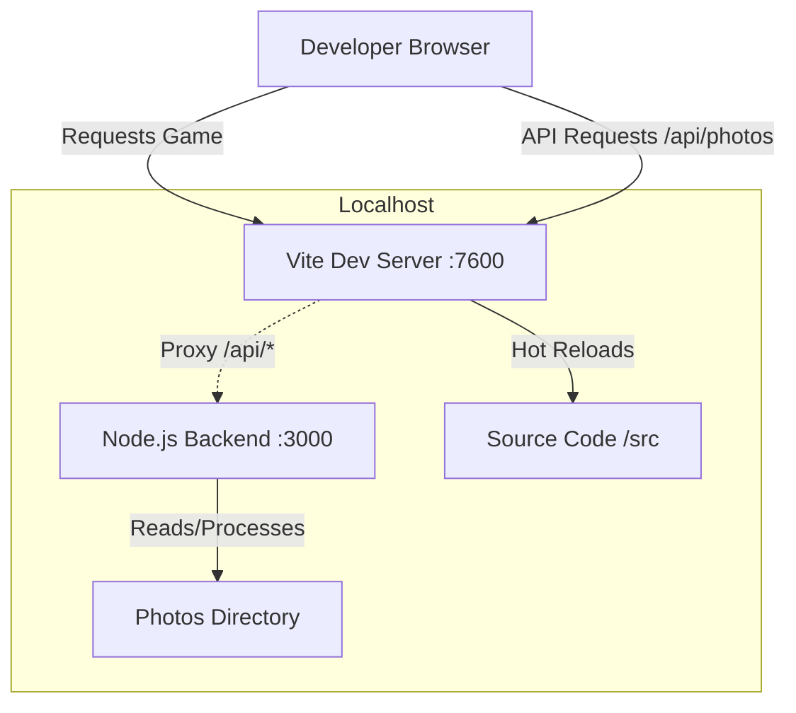
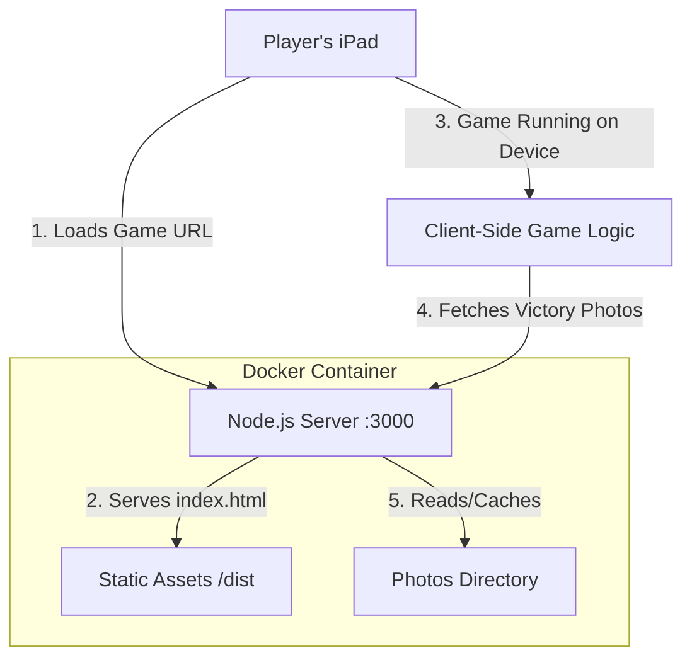

# Application Architecture

This document explains the high-level architecture of Shaomeme Fighter, detailing how the frontend and backend interact in both development and production environments, and explaining the logic behind the single-container deployment strategy.

## 1. Development vs. Production Architecture

The application uses different architectural patterns for development (to maximize developer experience and hot-reloading) and production (to maximize performance and simplify deployment).

### A. Development Environment (Two Processes)

In development, we run two separate servers that communicate via a proxy.

- **Vite Server (`:7600`)**: Handles the game frontend (`src/`). It provides instant "Hot Module Replacement" (HMR), so changes to code appear instantly in the browser.
- **Node Backend (`:3000`)**: Handles the API logic (Photos, Soundtracks).
- **Proxy**: Vite is configured to "forward" any request starting with `/api` to the Node backend. This prevents Cross-Origin (CORS) errors during development.

### B. Production Environment (Single Container)

In production, the "Frontend Server" (Vite) is removed entirely to save resources. The Node.js backend takes over the responsibility of serving the game files.

1.  **Build Phase**: Before the container starts, `vite build` compiles the game into a `dist/` folder. This folder contains optimized, static HTML, CSS, and JS files.
2.  **Server Unification**: The Node.js backend is configured to serve these static files from `dist/` for any request that isn't an API call.
3.  **Efficiency**: This allows us to deploy a **single Docker container** that handles everything.

## 2. Why One Container?

The confusion often arises from the distinction between "Client-Side Code" and "Server-Side Code".

- **The Game (Client-Side)**: Once the `index.html` and `.js` files are sent to the user's iPad, the Node.js server is **done** with the game logic. The fighting, physics, and animations happen entirely on the iPad's CPU/GPU. The server sits idle.
- **The API (Server-Side)**: The server only "wakes up" when the iPad explicitly asks for data, such as:
  - "Get me the list of cities" (`/api/cities`)
  - "Get me photos for Dublin" (`/api/photos?city=dublin`)

By bundling the static game files with the API server, we simplify deployment (one service to manage) and reduce overhead (no need for a separate Nginx container just to serve three static files).

## 3. Memory Usage Context

Since the game logic runs on the client, server memory usage is exclusively related to **API operations**, specifically image processing during the Victory Slideshow.

- **Idle State**: When players are fighting, the server uses minimal RAM (~50-100MB).
- **Active State**: When a player wins and the "Victory Slideshow" starts, the server processes images sequentially, streaming from disk to maintain a stable and low memory footprint.

See `docs/technical/IMAGE_PROCESSING_OPTIMIZATION.md` for details on the optimization implementation.
