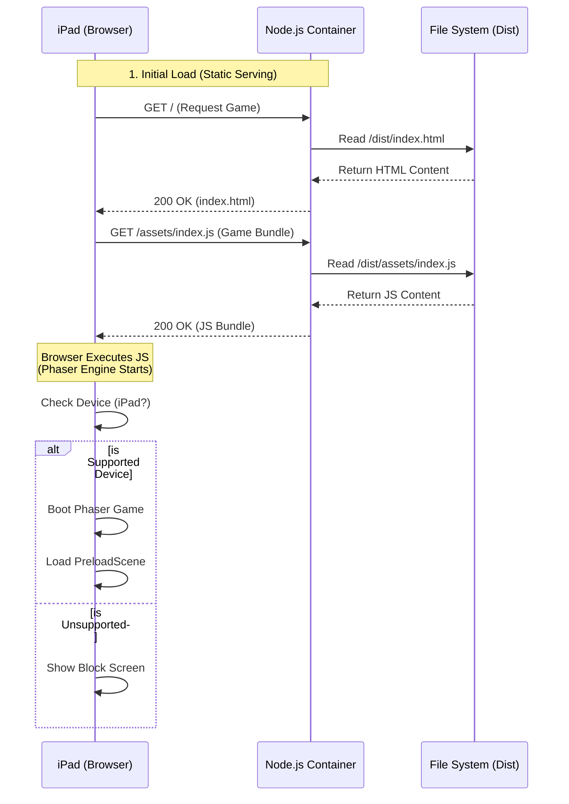
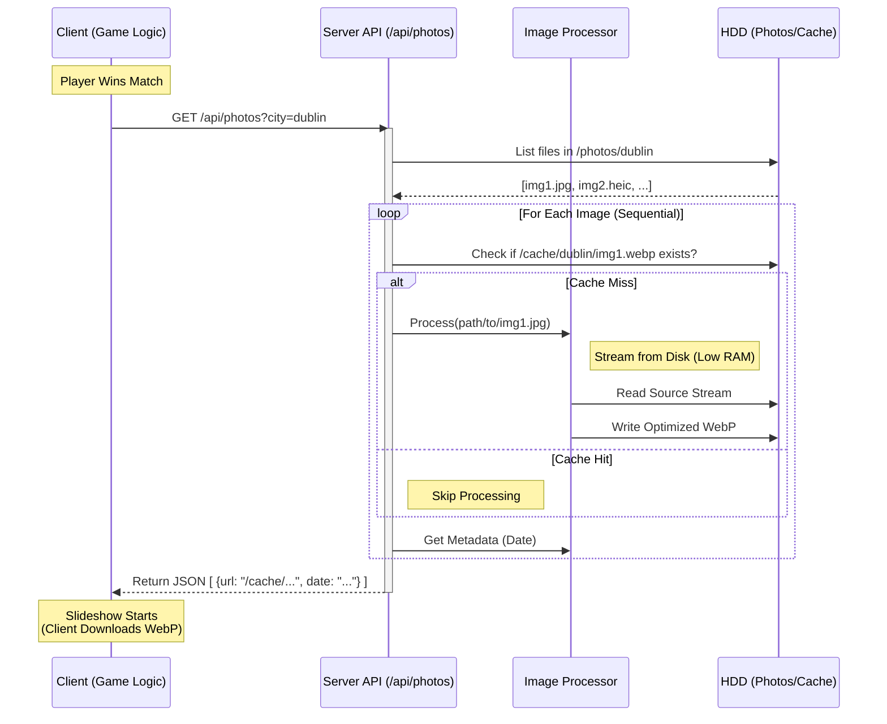
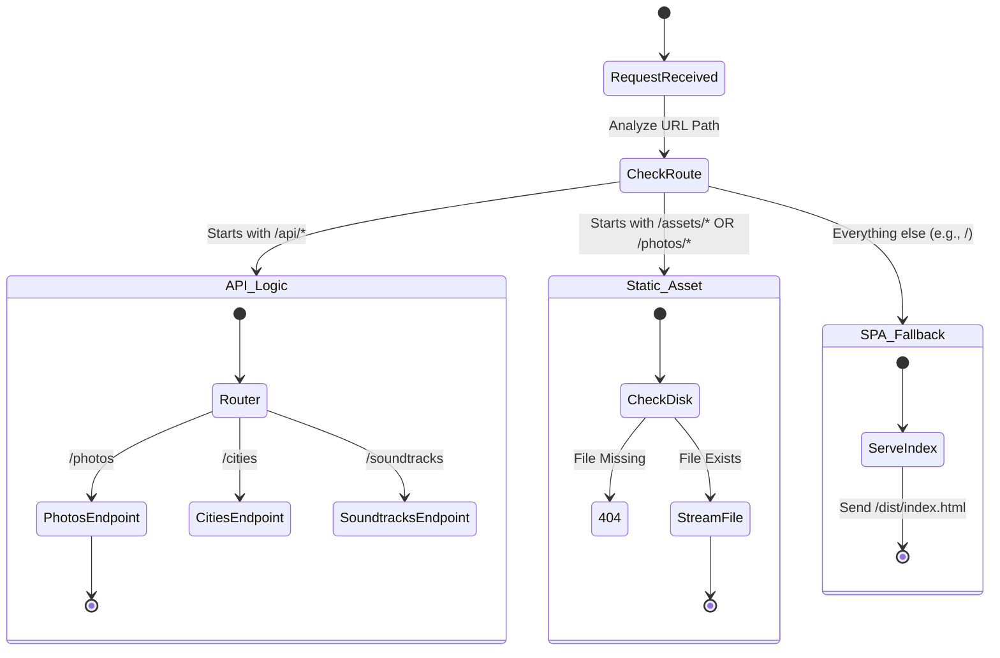

# System UML Diagrams

This document complements `ARCHITECTURE.md` by providing detailed UML sequence and activity diagrams to visualize the specific processes within the Shaomeme Fighter system, particularly the initialization flow and the Victory Slideshow data flow.

## 1. Game Initialization Sequence

This sequence diagrams how the single-container server delivers the game to the client (iPad) and how the game bootstraps itself.

## 2. Victory Slideshow Data Flow (Optimized)

This diagram illustrates the interaction between the client and server during the Victory Slideshow, highlighting the current optimized processing flow designed for high performance and low memory footprint.

## 3. Server Activity Diagram (Request Handling)

This activity diagram shows how the Node.js server decides whether to act as an API or a File Server for any given request.

